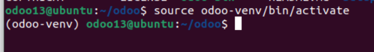
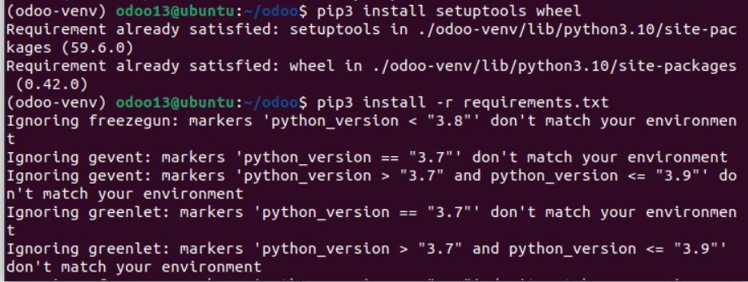
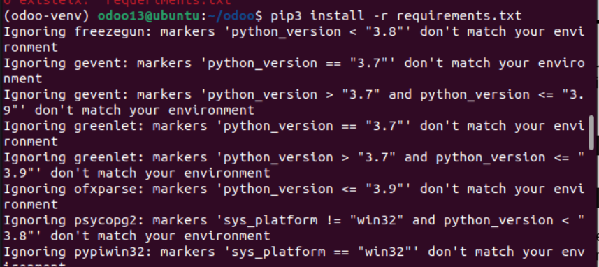
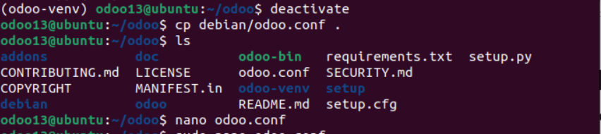
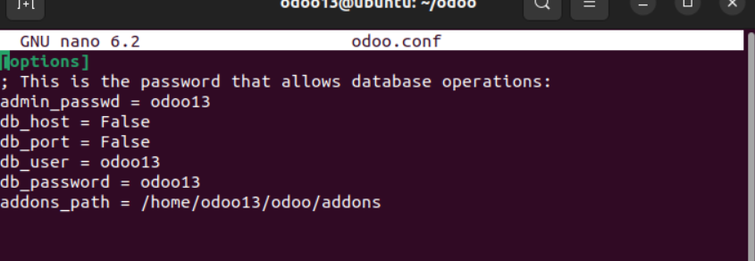
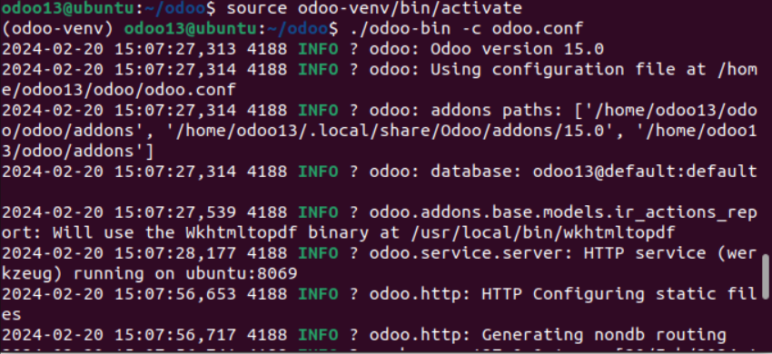
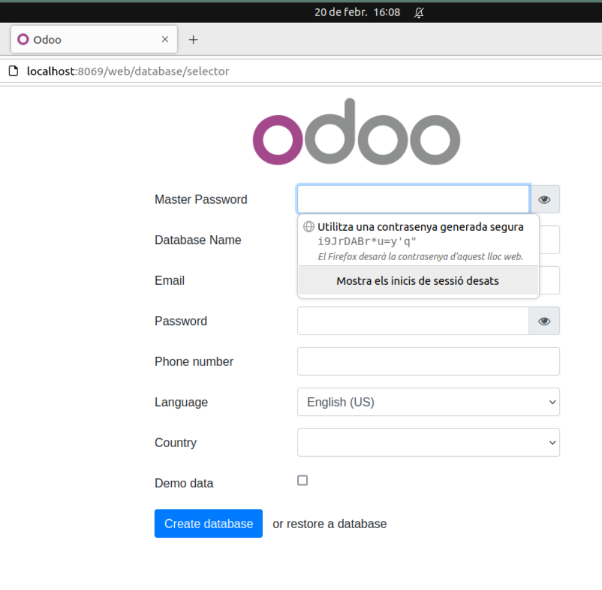

Captura insercion registro a tabla USERS

Captura metodo read

Captura antes del metodo delete

Captura despues del metodo delete

Captura antes del metodo update

Captura despues del metodo update 

Captura metodo crear tabla USERS2

#tutorial instalar odoo

paso 1:
![cap1]
(cap1.png)

paso 2:

Paso 3:

Paso 4:

Paso 5:

Paso 6:

Paso 7:

Paso 8:

Paso 9:

Paso 10:

Paso 11:

Paso 12:

Canviar usuari de sistema odoo y entrar en /home/odoo13

Descargar codigo odoo de github y ver lo que hay dentro

Creacion de un entorno virtual de python dentro del directorio de odoo

Activar entorno virtual:

Instalar requisitos de python dentro de directorio virtual:

Instalar fichero requirements.txt 

Parametros para editar el fichero odoo-conf:

Asi queda el fichero odoo-conf editado:

Activar otra vez entorno virtual y ejecutar odoo:

Odoo:

