Captura insercion registro a tabla USERS

Captura metodo read

Captura antes del metodo delete

Captura despues del metodo delete

Captura antes del metodo update

Captura despues del metodo update 

Captura metodo crear tabla USERS2

#tutorial instalar odoo

paso 1:
![cap1]
(cap1.png)

paso 2:
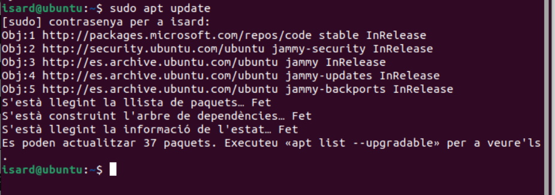

Paso 3:
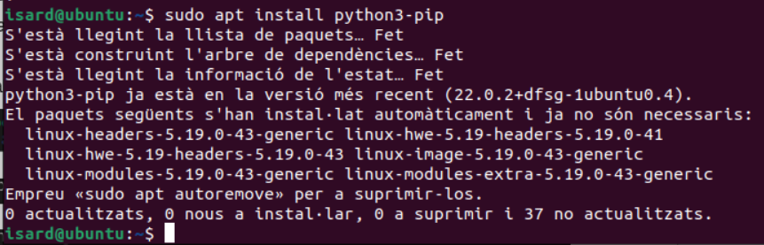

Paso 4:
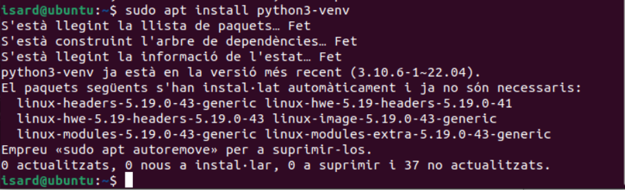

Paso 5:
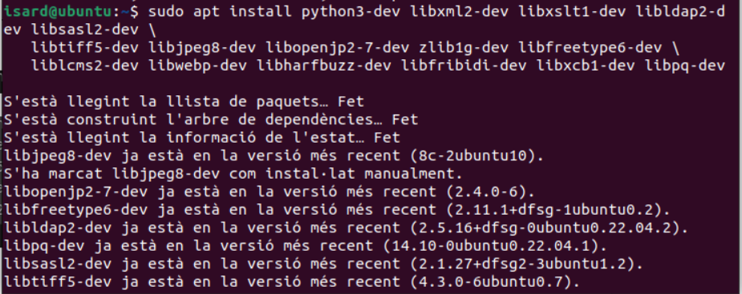

Paso 6:
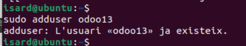

Paso 7:
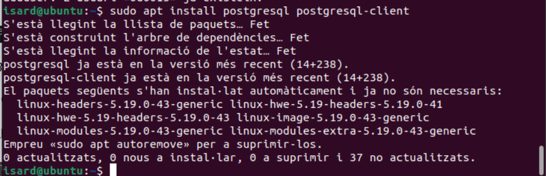

Paso 8:
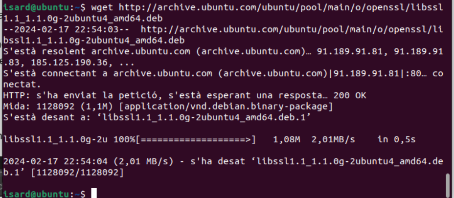

Paso 9:
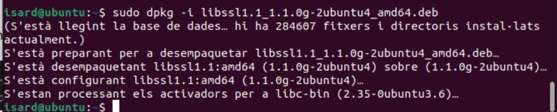

Paso 10:
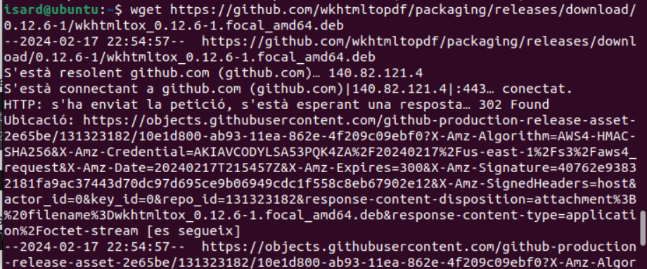

Paso 11:
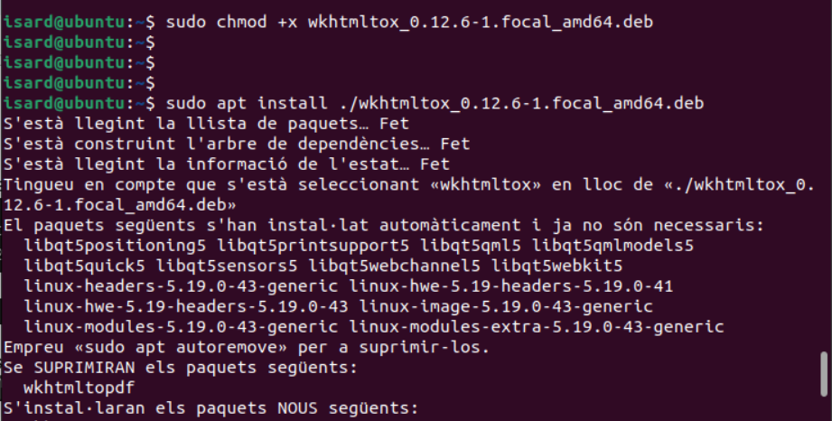

Paso 12:
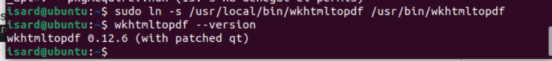

Paso 13:
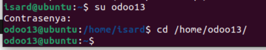

Paso 14:
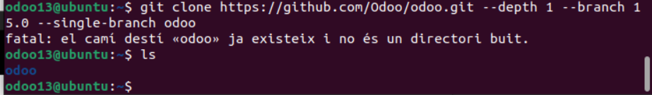

Paso 15:
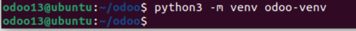
