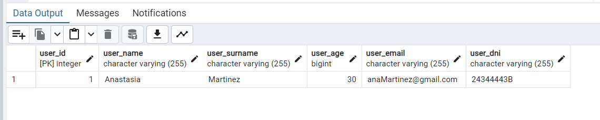
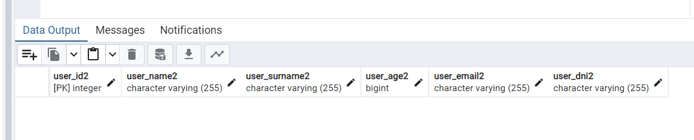
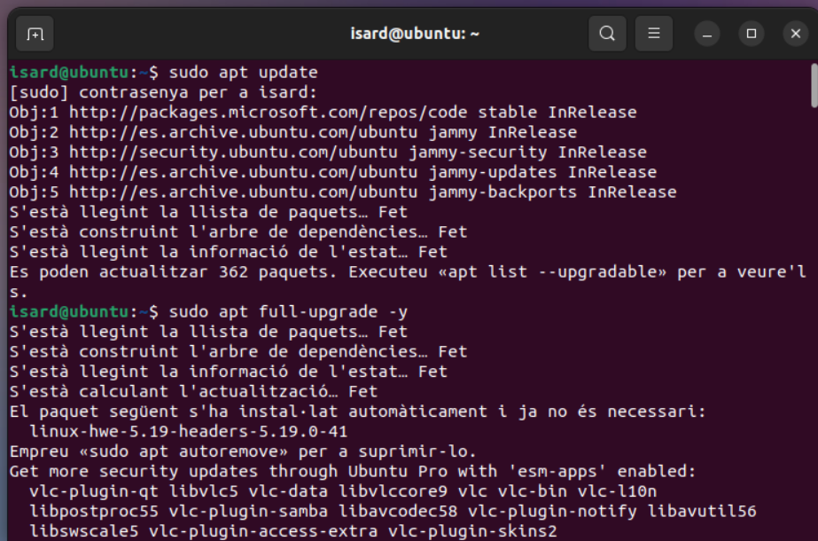
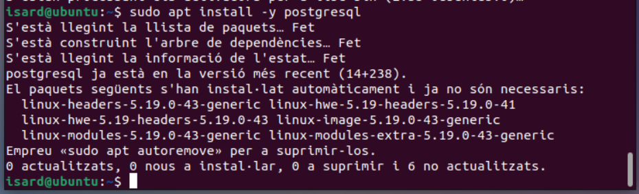
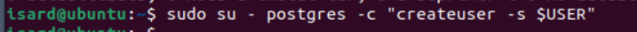
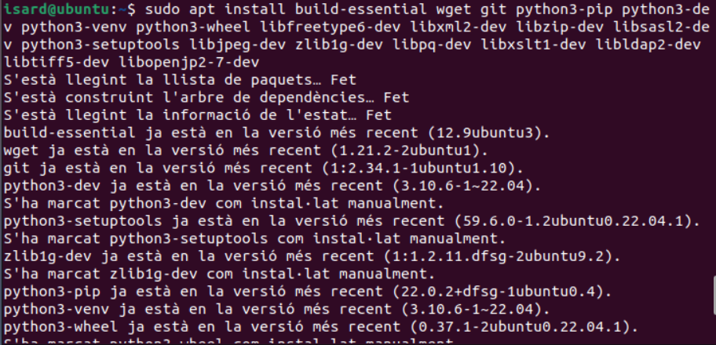
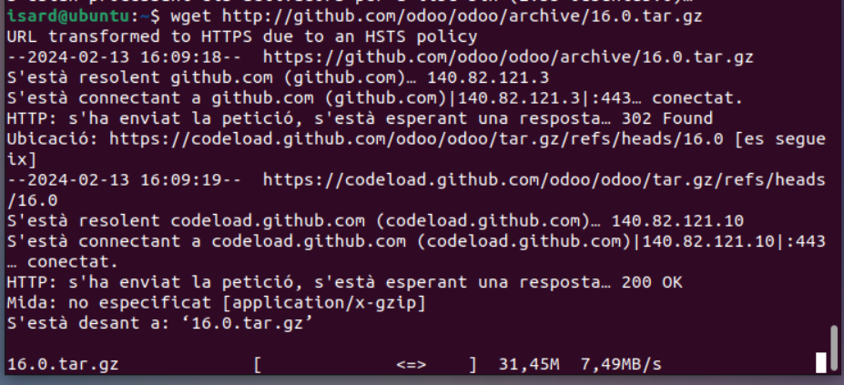
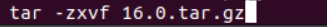
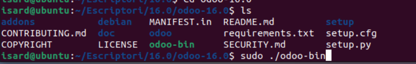

Captura insercion registro a tabla USERS

Captura metodo read

Captura antes del metodo delete

Captura despues del metodo delete

Captura antes del metodo update

Captura despues del metodo update 

Captura metodo crear tabla USERS2

#tutorial instalar odoo

paso 1:

paso 2:

Paso 3:

Paso4:

Paso5:

descomprimimos en directorio /Escriptori:

Ejecutamos el archivo odoo.py:

